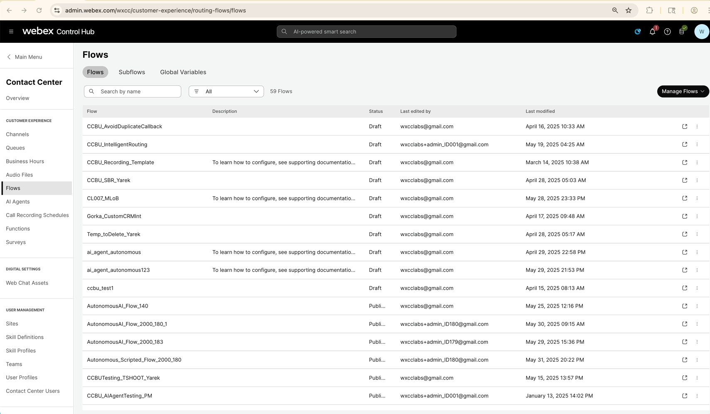
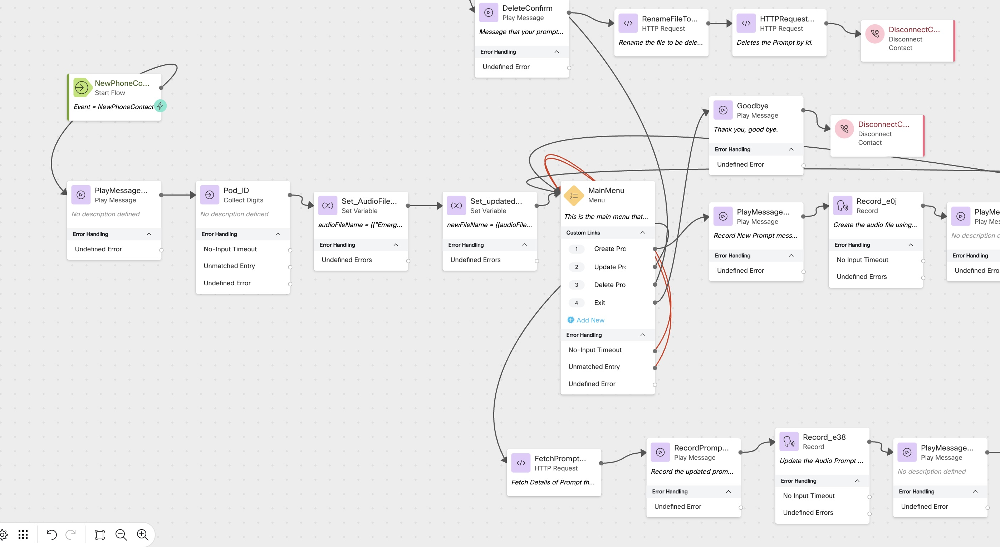

#  Lab: Dynamically Controlling Emergency Audio in Webex Contact Center Using API

##  Storyline

In this lab, you will learn how to **dynamically record or update an Emergency prompt** in Webex Contact Center (WxCC). This is especially useful during emergency scenarios where a **Supervisor or Administrator** needs to record a new message or update an existing one in real-time — for instance, during a sudden outage or a weather-related closure.

The flow also includes an option to delete an audio file. **However, it is strongly recommended not to delete any prompts during this lab**. The delete option is provided for completeness and for those looking to reuse the same flow in a production environment.

---

##  High-Level Explanation

- A call enters the **Emergency Message Recording flow**.
- Initial nodes dynamically create an **audio file name** in the format: ```Emergency_<PodID>.wav```
- The caller is presented with a **menu** that offers three options:
1. **Record a new emergency prompt**
2. **Update an existing emergency prompt**
3. **Delete an existing prompt** (Use with caution)
- Based on the selected option, the flow uses the **Webex Contact Center Audio File APIs** (via Connector) to:
- **Record**: Allow the caller to record a new prompt.
- **Update**: Replace the existing prompt with a new recording.
- **Delete**: Remove the prompt (optional; not recommended during this lab).
- The newly recorded prompt is stored using the generated file name and can be used later in other flows for emergency call handling.

---

##  Preconfigured Elements

1. we will importing flow from  **Flow Template**.
2. A **Connector** configured to call Webex Contact Center Audio File APIs (upload, update, delete).
3. All the  **Local Variablese** required for the flow are pre confiugured and available when you import the template.

---

### Select a Flow Template

- Under **Flow** >**Manage Flows**> **Create Flows**, select **Flow Template**
- Select **"Audio Prompt Recording and Management"**
- Click **View Details**
  - Click **Select Template**
- Click **Next**
  - Rename the  flow  <copy>CL<w class="POD"></w>_emeraudio</copy>
- Click **Create Flow** and confirm that the flow loads in the Flow Canvas

### <details><summary>CreatefromTemplate</summary></details>


### Add a Play Message node

> ```Edit``` the flow 

> Activity Label: <copy>Play_wlc</copy>
>
> Enable Text-To-Speech
>
> Select the Connector: Cisco Cloud Text-to-Speech
>
> Click the Add Text-to-Speech Message button
>
> Delete the Selection for Audio File
>
> Text-to-Speech Message: <copy>Welcome to Cisco Live, Let's set the name of the Emergency file, before we play with updating the same.</copy>
>
>> Delete the existing path from  New Contact node and connect it  to the play welcome message node

---
### Add a Collect Digits node

> Activity Label: <copy>Pod_ID</copy>

> Connect the Play message output node edge to Collect Digit node
>
> Enable Text-To-Speech
>
> Select the Connector: Cisco Cloud Text-to-Speech
>
> Click the Add Text-to-Speech Message button
>
> Delete the Selection for Audio File
>
> Text-to-Speech Message: <copy>Please enter your 3 digit pod id</copy>
>
---

### Add a Set Variable node

>Connect the Collect Digit Node   edge to Set Variable node

>Activity Label: <copy>Set_AudioFileName</copy>

> Variable: <copy>audioFileName</copy>
>
> Select Set Value
>
> Value <copy>`{{"Emergency_" ~ Pod_ID.DigitsEntered ~ ".wav"}}`</copy>
>
---

### Add an another Set Variable node

>Connect the Set Variable Node   edge to Set Variable node

>Activity Label: <copy>Set_updatedFile</copy>

> Variable: <copy>newFileName</copy>
>
> Select Set Variable
>
> and select preconfigured ```audioFileName``` from the drop down
>

---

### <details><summary>CheckyourFlow</summary></details>

---
## Publish Your Flow

- Turn on **Validation** at the bottom right corner of the Flow Builder
- If there are no Flow Errors, click **Publish**
  - Add a **Publish Note**
  - Add a **Version Label**: `Live`
  - Click **Publish Flow**

  

---


## Map Your Flow to Your Inbound Channel

1. Navigate to **Control Hub > Contact Center > Channels**
2. Locate your **Inbound Channel** (use the search bar)
3. Select the **Routing Flow**: `CL_core`
4. Select the **Version Label**: `Live`
5. Click **Save** (bottom-right corner)

---


##  Testing the Flow

- Call into the flow. You will be greeted and asked to enter your **Pod ID**.
- Upon entering the Pod ID, a variable will be dynamically created in the format: ```Emergency_<PodID>.wav```
- A menu will then be offered with the following options:
- **1** to create a new prompt
- **2** to update an existing prompt
- **3** to delete an existing prompt (⚠️ **please do not perform this option during the lab**)

###  To create a new prompt:
1. Select **Option 1** from the menu.
2. Record the prompt after the beep, then press **#** to finish.
3. Go to **Control Hub → Contact Center → Audio Files**.
4. Sort the list by **Date Created** and verify that a new prompt has been created.
5. You can **download and play** the prompt to confirm the recording.

###  To update an existing prompt:
1. Select **Option 2** from the menu.
2. Record the new message after the beep, then press **#** to finish.
3. Go to **Control Hub → Contact Center → Audio Files**.
4. Sort the list by **Date Modified** and verify that the prompt has been updated.
5. Download and play it to confirm the new message is applied.

---

> This test demonstrates how supervisors or admins can manage emergency Audio prompts dynamically in real-time using the IVR flow integrated with Webex Contact Center APIs.


---

## Debugging the Flow

- Open the **Debugger** in the Flow Builder
- Select the **last interaction** from the top of the list
- Trace the call steps
  - You can view the **path**, **input/output variables**, and **events**
