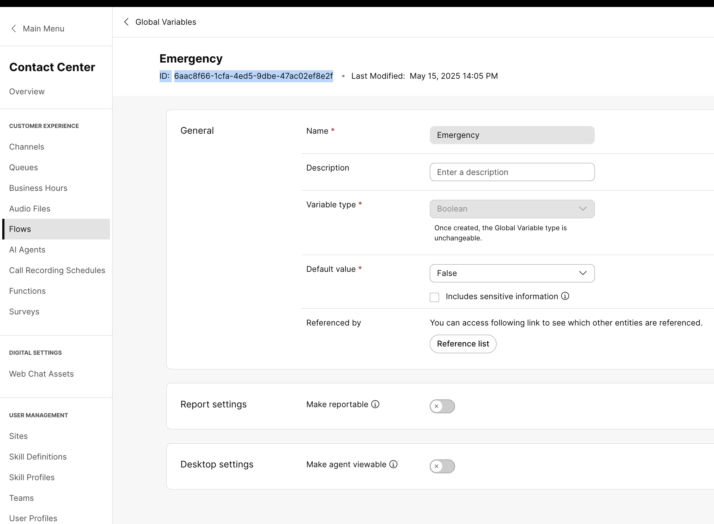
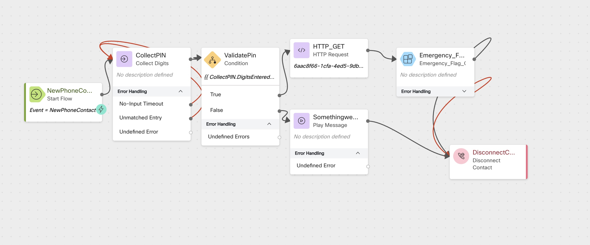

#  Lab: Dynamically Controlling Emergency Flag in Webex Contact Center Using API

## Storyline

In this lab, you will learn how to **dynamically change the Emergency flag** in a Webex Contact Center (WxCC) environment by calling a script as a **Supervisor or Administrator**. This enables real-time routing behavior adjustments — such as diverting calls to a special queue or playing emergency announcements — during critical situations like outages or weather alerts.

---

##  High-Level Explanation

- A call enters the **IVR flow**.
- The **caller is prompted to enter a Supervisor/Administrator password**.
- If the password is correct:
  - The **current status** of the Emergency flag is **retrieved and played back** (e.g., *Emergency flag is currently ON/OFF*).
  - The caller is then **offered an option to change the Emergency status**.
- Based on the caller's choice, the script **invokes a WxCC API** (via connector) to **update the Global Variable** controlling Emergency Flag.
- This flag controls downstream behavior in the flow (e.g., route to emergency queue or play special message).

---

##  Preconfigured Elements

1. **Global Variable**:
   - Please reach out to Proctor to get a Boolean global variable named `emergencyFlag_<YourPodID>` 
   - Proactor will also give you Global Variable ID 
   - This variable holds the current Emergency status (true/false).

2. **Connector**:
   - A connector is available in the flow to call **Webex Contact Center APIs**.
   - It is used to **read and update** the Emergency flag via API.

3. **Supervisor Password**:
   - The password required for authentication is: `9638`.


### Create these Flow Variables
> Name: <copy>HTTPStatusVar</copy>
>
> Type: String
>
> Default Value: Leave Empty
---
> Name: <copy>Emergency_Value_Check</copy>
>
> Type: String
>
> Default Value: Leave Empty
---
> Name: <copy>Emergency_Value_Check</copy>
>
> Type: String
>
> Default Value: Leave Empty
---
> Name: <copy>Gloabal_ID</copy>
>
> Type: String
>
> Default Value: <Variable ID you get from the proctor>
---
> Name: <copy>Global_Name</copy>
>
> Type: String
>
> Default Value: < Variable you get from the proctor>
---

### Create a new flow
> Create a new flow named <copy>CL<w class="POD"></w>_emer</copy>

---
### Add a Collect Digits node
> Activity Label: <copy>CollectPIN</copy>

> Connect the New Phone Contact output node edge to Collect Digit node
>
> Enable Text-To-Speech
>
> Select the Connector: Cisco Cloud Text-to-Speech
>
> Click the Add Text-to-Speech Message button
>
> Delete the Selection for Audio File
>
> Text-to-Speech Message: <copy>Please enter 4 digits pin code to activate emergency flow</copy>
>
---

### Add a Condition node
> Activity Label: <copy>ValidatePin</copy>
>
> Expression: <copy>`{{ CollectPIN.DigitsEntered == "9638"}}`</copy>
>
> Connect the True node edge to the HTTP Request node, in the next step you will learn HTTP Configuration
>
> Connect the False node edge to the play welcome message node
>
---

### Add a HTTP Request Node
> Activity Label: <copy>HTTP_GET</copy>

> Under Connector Select ```Wxcc_API``` 

> Request Path: <copy>`/organization/e56f00d4-98d8-4b62-a165-d05a41243d98/cad-variable/{{Gloabal_ID}}`</copy>

> Example ```/organization/e56f00d4-98d8-4b62-a165-d05a41243d98/cad-variable/{{Gloabal_ID}}``` 

>The ID can be found in Flows>Global Variables>Select `emergencyFlag_<YourPodID>` and copy the ```ID``` , Lab Proctor will give this ID 

### <details><summary>GlobalVariable_ID</summary></details>


> Under Connector Select ```GET``` 
>
> Under Connector Select ```Appliation/JSON``` 
>

> ParseSetting 

>  Content Type -- ```JSON``` 
>  OutPutVariable -- ```Emergency_Value_Check```
> Path Expression -- ```$.defaultValue``` 

---
### Add a Play Message node
> Connect the False node edge to the play welcome message node
>
> Activity Label: <copy>SomethingwentWrongMsg</copy>
>
> Enable Text-To-Speech
>
> Select the Connector: Cisco Cloud Text-to-Speech
>
> Click the Add Text-to-Speech Message button
>
> Delete the Selection for Audio File
>
> Text-to-Speech Message: <copy>Some thing went wrong please reach out to your Administrator.</copy>
>

---

### Add a Subflow node
> Name: Emergency_Flag_OnOff
>
> Connect the HTTP_GET node  to this Subflow node
>
> Subflow Label: Live
>
> Map Subflow Input Variables
>
>> Click Add New
>>
>> Current Flow Variable: <copy>Gloabal_ID</copy>
>>
>> Subflow Input Variable: <copy>GV_ID</copy>
> 
> 
>> Click Add New
>>
>> Current Flow Variable: <copy>Global_Name</copy>
>>
>> Subflow Input Variable: <copy>GV_Name</copy>

Click Add New
>>
>> Current Flow Variable: <copy>Emergency_Value_Check</copy>
>>
>> Subflow Input Variable: <copy>Emergency_Value_Check1</copy>
>

---

### Add a Disconnect Contact node
> Connect the Output node edge from the Subflow  and play message node to this Disconnect Contact node
>
---

### <details><summary>CheckyourFlow</summary></details>

## Publish Your Flow

- Turn on **Validation** at the bottom right corner of the Flow Builder
- If there are no Flow Errors, click **Publish**
  - Add a **Publish Note**
  - Add a **Version Label**: `Live`
  - Click **Publish Flow**

  

---

## Map Your Flow to Your Inbound Channel

1. Navigate to **Control Hub > Contact Center > Channels**
2. Locate your **Inbound Channel** (use the search bar)
3. Select the **Routing Flow**: `CL_core`
4. Select the **Version Label**: `Live`
5. Click **Save** (bottom-right corner)

---

## Testing the Emergency Control Flow

1. Call into the **Emergency Control Script** using your assigned **Inbound Channel Number**
2. When prompted, enter the **Supervisor/Administrator password**: `9638`
3. You will hear the **current status** of the Emergency flag (e.g., *Emergency mode is OFF*)
4. Press **1** to enable Emergency mode
5. Open the **Webex Contact Center Developer Portal** and **verify that the global variable value is now set to `true`**
6. Call the script again and **enter the password `9638`**
7. This time, **press 2 to disable Emergency mode**
8. Return to the **Developer Portal** and verify that the **Emergency flag is now set to `false`**

---

## Debugging the Flow

- Open the **Debugger** in the Flow Builder
- Select the **last interaction** from the top of the list
- Trace the call steps
  - You can view the **path**, **input/output variables**, and **events**
