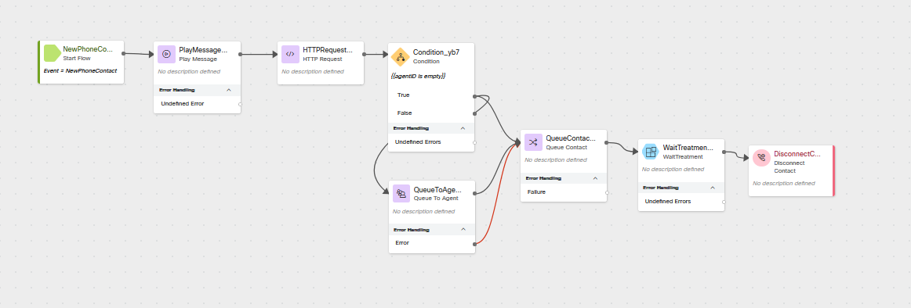

# Lab 2 - Last Agent Routing Using Simulated Auto CSAT

## Story
> A common request for returning customers calling into a contact center is to work with the last person with which they had a good experience.  This may be because they are already familiar with what the customer needs or it may just be that the customer is familiar with the agent and enjoyed their last interaction. With the new Auto CSAT feature in the Webex Contact Center we can automatically account for this request and route to the last agent which had a high Auto CSAT with the customer.  
> !!! Note
      Because this is a lab environment and you will be playing both the role of the customer and agent, we are going to use a simulated CSAT as it would be difficult to properly score a call in these conditions.  


### High Level Explanation
1. New call comes into the flow
2. Call the Search API to find the last agent with which they had a good CSAT
3. If the agent is available, we will route the call to that agent
4. If the agent is not available or if no recent good CSAT scores exits for the caller, we will route the call to the queue for the next available agent. 


## Preconfigured elements
1. Wait treatment Subflow which will provide Music in Queue and Queue Messages. 
2. Connector for calling Webex Contact Center APIs
3. Agent Editable and Reportable Global Variable for our simulated CSAT

---

## Build
### Create an new flow

> Create a flow named <copy>CL<w class="POD">yourLabID</w>_LARwCSAT</copy>

### Create these flow variables

> Name: <copy>agentID</copy>
>
> Type: String
>
> Default Value: empty

---

> Name: <copy>queriedCSAT</copy>
>
> Type: Decimal
>
> Default Value: <copy>0.0</copy>

---

### Add the Global Variable simulatedCSAT to the flow
> There are no values to set because it has already been configured globally

---

### Add a Play Message node for our welcome message

> Connect the New Phone Contact to this Play Message node
>
> Enable Text-To-Speech
>
> Select the Connector: Cisco Cloud Text-to-Speech
>
> Click the Add Text-to-Speech Message button
>
> Delete the Selection for Audio File
>
> Text-to-Speech Message: <copy>Welcome to the Last Agent Routing with auto CSAT lab.</copy>
>
---


### Add an HTTP Request node for our query
> Connect the output node edge from the Play Message node to this node
>
> Select Use Authenticated Endpoint
>
> Connector: WxCC_API
> 
> Path: /search
> 
> Method: POST
> 
> Content Type: GraphQL
>
> Copy this GraphQL query into the request body:
> 
```GraphQL
query simulatedCSAT(
  $from: Long!
  $to: Long!
  $timeComparator: QueryTimeType
  $filter: TaskFilters
  $name: String!
) {
  task(from: $from, to: $to, timeComparator: $timeComparator, filter: $filter) {
    tasks {
      owner {
        name #Agent Name
        id #Agent ID
      }
      simulatedCSAT: doubleGlobalVariables(name: $name) {
        name
        value #Value of the simulatedCSAT
      }
    }
  }
}
```
> Variables:
```JSON
{
  "from": "{{now() | epoch(inMillis=true) - 604800000}}", # time now - 1 week represented in EPOCH time(ms)
  "to": "{{now() | epoch(inMillis=true)}}", # time now represented in EPOCH time(ms)
  "timeComparator": "endedTime",
  "filter": {
    "and": [
      {
        "status": {
          "equals": "ended"
        }
      },
      {
        "origin": {
          "equals": "{{NewPhoneContact.ANI}}"
        }
      },
      {
        "doubleGlobalVariables": { #Filtering on the Global Variable simulatedCSAT to be greater or equal to 3 
          "name": {
            "equals": "simulatedCSAT" 
          },
          "value": {
            "gte": 3
          }
        }
      }
    ]
  },
  "name": "simulatedCSAT" #The Alias name used for the global variable in the returned fields
}
```
</details>

> Parse Settings:
>
> Content Type: JSON
>
> - Output Variable: `agentID`
> - Path Expression: <copy>`$.data.task.tasks[0].owner.id`</copy>
>
> - Output Variable: `queriedCSAT`
> - Path Expression: <copy>`$.data.task.tasks[0].simulatedCSAT.value`</copy>
>
---

### Add a Condition node
> Connect the output node edge from teh HTTP Request node to this node
> 
> Expression: <copy>`{{agentID is empty}}`</copy>
>
> We will connect the True node in a future step.
>
> Connect the False node edge to the Queue To Agent node created in the next step.
>
---

### Add a Queue To Agent node
> Agent Variable: agentID
>
> Agent Lookup Type: ID
>
> Set Contact Priority: True
>
> Select Static Priority
>
> Static Priority Value: P1
>
> Reporting Queue: <w class="Queue">yourQueueID</w>
>
> Park Contact if Agent Unavailable: False
>
> Recovery Queue: <w class="Queue">yourQueueID</w>
>
> Connect the Output and Error node edges to the Queue Contact node created in the next step
---

### Add a Queue Contact node
> Connect the True node edge from the Condition node to this node
> 
> Select Static Queue
>
> Queue: <w class="Queue">yourQueueID</w>
>
> Connect the Output node edge from this node to the Subflow node
---

### Add a Subflow node
> In the Activity Library pane on the left side of the screen, click Subflows
>
> Find the Subflow names WaitTreatment and drag it onto the flow canvas like you would any other node.
>
> Connect the output node edge from the Queue Contact node added in the previous step to this node.
>
> Subflow Label: Latest
>
> Enable automatic updates: True
>
> Subflow Input Variables: None
>
> Subflow Output Variables: None
>
> Connect the output node edge from this node to the Disconnect Contact node added in the next step.
---

### Add a Disconnect Contact node

---


### <details><summary>Check your flow</summary></details>

---

### Publish your flow
> Turn on Validation at the bottom right corner of the flow builder
>
> If there are no Flow Errors, Click Publish
>
> Add a publish note
>
> Add Version Label(s): Live 
>
> Click Publish Flow

---


### Map your flow to your inbound channel
> Navigate to Control Hub > Contact Center > Channels
>
> Locate your Inbound Channel (you can use the search): <copy><w class="EP"></w></copy>
>
> Select the Routing Flow: <copy>CL<w class="POD"></w>_LARwCSAT</copy>
>
> Select the Version Label: Live
>
> Click Save in the lower right corner of the screen

---

## Testing
1. Launch the [Agent Desktop](https://desktop.wxcc-us1.cisco.com/) and log in using the Desktop option.
2. On your Agent Desktop, set your status to available
      1. Using Webex, place a call to your Inbound Channel number <copy><w class="DN"></w></copy>
      2. You should be offered a call, click on the accept button. (You may want to mute the mic on both Webex and the Agent Desktop)
      3. In the Agent Desktop you will see a new field in Call Information section where you can edit the Simulated CSAT.  Enter a value of <copy>2.9</copy> and click save.
      4. After a few moments end the call and select a wrapup code.
3. Using Webex, place another call to your Inbound Channel number <copy><w class="DN"></w></copy>
      1. You should be offered the call, click on the accept button.
      2. Enter a value of <copy>3.7</copy> in for Simulated CSAT and click save.
      3. After a few moments end the call and select a wrapup code.
4. In your Flow:
      1. Open the debugger
      2. Select the first interaction (at the bottom of the list)
      3. Trace the steps taken in the flow
      4. Open the last interaction 
      5. Trace the steps taken in the flow
5. Answer these questions:
      1. Did the second call get routed to your agent via the Queue To Agent node?
         1. Why or why not
6. On your Agent Desktop, set your status to not be available
7. Using Webex, place another call to your Inbound Channel number <copy><w class="DN"></w></copy>
8. After you hear the queue treatment start, change your status to available on the agent desktop.
      1. You should be offered the call, click on the accept button.
      2. Enter a value of <copy>2.8</copy> in for Simulated CSAT and click save.
      3. After a few moments end the call and select a wrapup code.
9. In your Flow:
      1. Open the debugger
      2. Select the last interaction
      3. Trace the steps taken in the flow
10. Answer these questions:
      1. Was the call routed to the Queue to Agent node?
      2. What happened next?
         1. Why?
         2. What will happen if you call in again starting in the Available status?
11. Make sure that you are in Available status on the agent desktop.
12. Using Webex, place another call to your Inbound Channel number <copy><w class="DN"></w></copy>
      1. You should be offered the call, click on the accept button.
      2. After a few moments end the call and select a wrapup code.
13. In your Flow:
      1. Open the debugger
      2. Select the last interaction
      3. Trace the steps taken in the flow
14. Answer the following questions:
      1. Was the call offered to you from the Queue to Agent node?
      2. What was the value of the variable queriedCSAT (look in the HTTP node step)
         1. Why?
      3. How do you think that you could change the logic/criteria to meet other business needs? 


# Once you have completed the testing, go pick another adventure from the [Adventure Section](adventureList.md)
---
