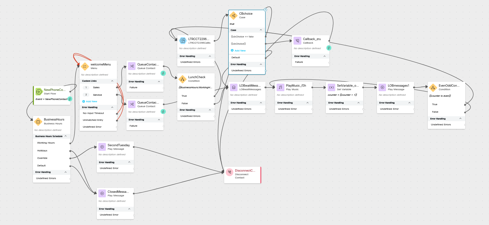
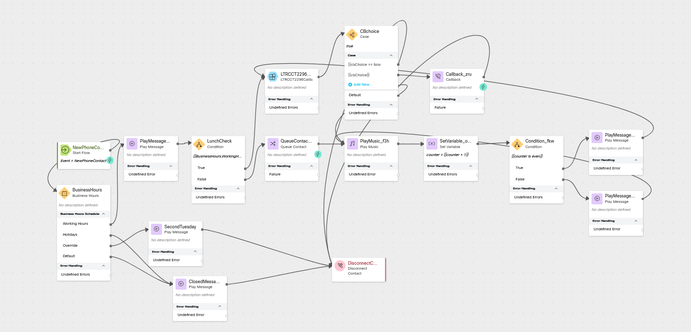

# Offering a Callback option to calls actively waiting in the queue

## Story
> If your wait times are longer than your caller wants to listen to your hold music for, you can offer to hold their place in the queue and call them back when it is their turn.  In this lab you will be adding the callback functionality to the CL<w class="POD"></w>_core</copy> flow.

### High Level Explanation
1. This section is optional but can explain the order of operations
2. 

## Preconfigured elements
1. If you are using a prebuilt subflow or function 
2. You should call attention to a shared configuration item which is important to the success of the flow, like a connector  

## Build
### Open flow <copy>CL<w class="POD"></w>_core</copy>
> Toggle the Edit switch on
>
---

??? Note "If you have previously completed the Multiple Lines of Business Using the Same Flow lab"    
    ### Replace the CBchoice node with a Case node
    > Click on the CBchoice and delete it.
    >
    > Add a new Case node
    >
    >> Activity Label: <copy>CBchoice</copy>
    >>
    >> Select Build Expression
    >>
    >> Value: <copy>true</copy>
    >>
    >> In the Link Description section:
    >>>
    >>> Replace Case 0 with: <copy>{{cbChoice == false and BusinessHours.WorkingHoursShift_Name == "Lunch" and welcomeMenu.OptionEntered == "1"}}</copy>
    >>>
    >>> Replace Case 1 with: <copy>{{cbChoice}}</copy>
    >
    > Connect the output node from the Subflow node to to input node edge of this node
    >
    > Connect the {{cbChoice == false and BusinessHours.WorkingHoursShift_Name == "Lunch"}} node edge to the Disconnect Contact node
    >
    > Connect the {{cbChoice}} node edge to the Callback node
    >
    > Connect the Default node edge to the Play Music node
    >
    ---
    
    ### Add a new Condition node
    > Activity Label: <copy>EvenOddCondition</copy>
    >
    > Expression: <copy>{{counter is even}}</copy> 
    > 
    > Connect the True Node edge of this Condition node to the Subflow node
    >
    > Connect the False node edge of this Condition node to the Play Music Node
    >
    > Delete the connection from LOBmessages1 to the Play Music node
    >
    > Connect the outbound node edge from LOBmessages1 to the inbound node edge of this Condition node
    >
    ??? Note "Check your flow"    
        

??? Note "If you have NOT previously completed the Multiple Lines of Business Using the Same Flow lab"    
    ### Replace the CBchoice node with a Case node
    > Click on the CBchoice and delete it.
    >
    > Add a new Case node
    >
    >> Activity Label: <copy>CBchoice</copy>
    >>
    >> Select Build Expression
    >>
    >> Value: <copy>true</copy>
    >>
    >> In the Link Description section:
    >>>
    >>> Replace Case 0 with: <copy>{{cbChoice == false and BusinessHours.WorkingHoursShift_Name == "Lunch"}}</copy>
    >>>
    >>> Replace Case 1 with: <copy>{{cbChoice}}</copy>
    >
    > Connect the output node from the Subflow node to to input node edge of this node
    >
    > Connect the {{cbChoice == false and BusinessHours.WorkingHoursShift_Name == "Lunch"}} node edge to the Disconnect Contact node
    >
    > Connect the {{cbChoice}} node edge to the Callback node
    >
    > Connect the Default node edge to the Play Music node
    >
    ---
    
    ### Update these node connections
    > Delete the connection from the Play Message node which is connected to the True node edge of the Condition node
    >
    > Connect the Play Message node which is connected to the True node edge of the Condition node to the Subflow node

    ??? Note "Check your flow"    
        
>

---

---

### Publish your flow
> Turn on Validation at the bottom right corner of the flow builder
>
> If there are no Flow Errors, Click Publish
>
> Add a publish note
>
> Add Version Label(s): Test 
>
> Click Publish Flow

---

### Map your flow to your inbound channel
> Navigate to Control Hub > Contact Center > Channels
>
> Locate your Inbound Channel (you can use the search): <copy><w class="EP"></w></copy>
>
> Select the Routing Flow: <copy>CL<w class="POD"></w>_core</copy>
>
> Select the Version Label: Test
>
> Click Save in the lower right corner of the screen

---

## Testing
1. Launch the [Agent Desktop](https://desktop.wxcc-us1.cisco.com/) and log in using the Desktop option.
2. Using Webex, place a call to your Inbound Channel number <copy><w class="DN"></w></copy>
3. 

---

# Once you have completed the testing, go pick another adventure from the [Adventure Section](adventureList.md)