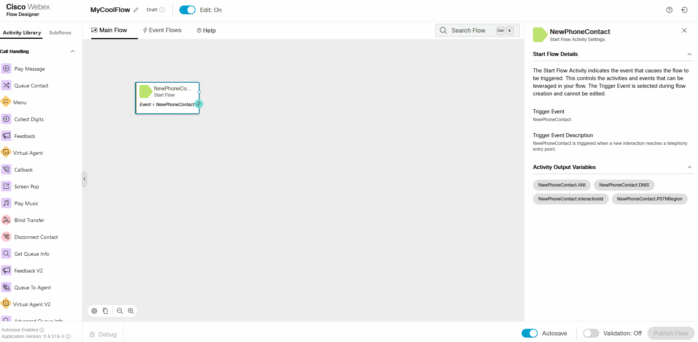
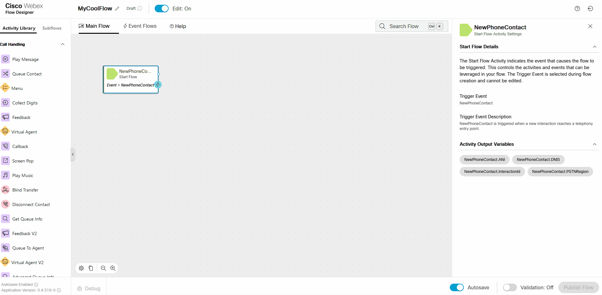
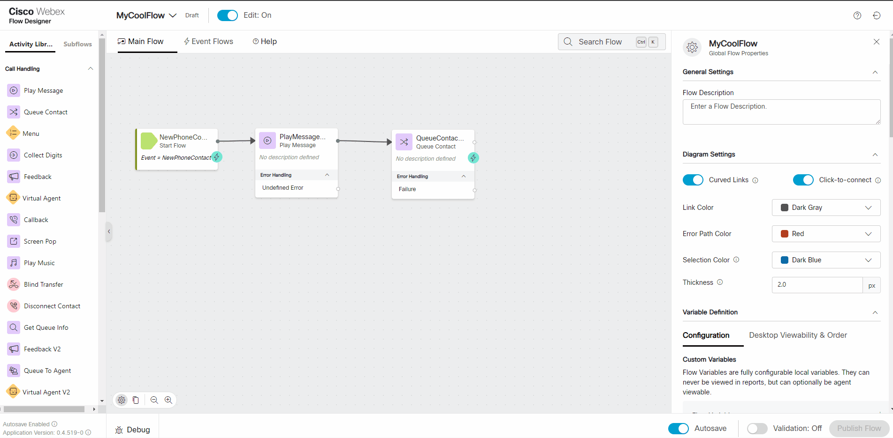
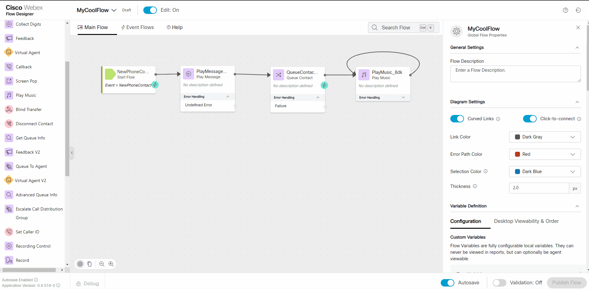

# Cheat Sheet

## 

Create a New Flow

## 

Create Flow Variables

## 

Add Global Variables to a Flow

## 

Add a Node to a Flow

## 

Add a Subflow to a Flow

## 

Publish a Flow

## 

Map a Flow to an Inbound Channel (Assign an Inbound Number)

