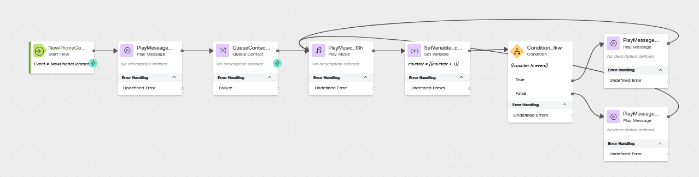

# Core Lab 2 - Enhancing the Wait Treatment

## Learning Objectives

In this section of the lab we will continue building and testing together.  We will be enhancing the the wait treatment section of our floe to play alternating comfort messages every 30 seconds the caller is on hold and continue the hold music where it left off (instead of starting it over every 30 seconds).

## New Elements
 - Variables
 - Pebble Templates
 - FLow Logic

## Build

### Open flow CL<w class="POD">_core</w>
> Toggle the Edit switch on
>
---

### Create a  Flow Variable
> Name: <copy>counter</copy>
>
> Type: Integer
>
> Default Value: empty

---

### Add a Set Variable node
> Variable: <copy>counter</copy>
>
> Select Set Value
>
> Value <copy>`{{counter + 1}}`</copy>
>
> Delete the loop connection on the Play Music node
>
> Connect the Play Music output node edge to this Set Variable node

---

### Add a Condition node
> Connect the Set Variable output node edge to this Condition node
>
> Expression: <copy>`{{counter is even}}`</copy>
>

---

### Add a Play Message node
> Connect the True node edge of the previous Condition node to this Play Message node
>
> Enable Text-To-Speech
>
> Select the Connector: Cisco Cloud Text-to-Speech
>
> Click the Add Text-to-Speech Message button
>
> Delete the Selection for Audio File
>
> Text-to-Speech Message: <copy>Comfort Message 1.</copy>
>
> Connect the Play Message node edge to the Play Music Node
>

---

### Copy the Previous a Play Message node
> Connect the False node edge of the previous Condition node to this Play Message node
>
> Edit the Text-to-Speech Message: <copy>Comfort Message 2.</copy>
>
> Connect the Play Message node edge to the Play Music Node

---

### Edit the Play Music node
> Start Offset: <copy>`{{counter * 30}}`</copy>
>
> Music Duration: <copy>30</copy>
>
---

### 

Check your flow

---

### Publish your flow
> Turn on Validation at the bottom right corner of the flow builder
>
> If there are no Flow Errors, Click Publish
>
> Add a publish note
>
> Add Version Label(s): Live 
>
> Click Publish Flow

---

## Testing
1. Launch the [Agent Desktop](https://desktop.wxcc-us1.cisco.com/){:target="_blank"} and log in selecting the Desktop option for your Voice connection (If it is not still open).
2. On your Agent Desktop, make sure your status is not set to Available
      1. Using Webex, place a call to your Inbound Channel number <copy><w class="DN"></w></copy>
      2. Listen to the wait treatment
3. Answer these questions:
      1. Did the Comfort messages alternate? 
      2. What happened with the hold music?