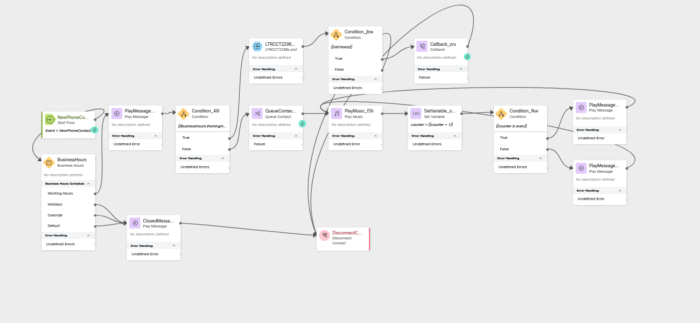

# Core Lab 4 - Business Hours Logic

## Learning Objectives

In this section of the lab we will continue building and testing together.  We will add a new option where we want to close the queue for lunch but let the caller opt-in for a callback when our agents return.

## New Elements
- Subflows
- Callback

## Edit Configuration Items

### Edit the Business Hours in Control Hub
> Navigate to Business Hours in Control Hub and open <copy>CL<w class="POD"></w>_Business Hours</copy> (if you previously closed it)
>
> Click on the Shift Name Open
>
>> Change the Name to <copy>Open AM</copy> 
>>
>> Click Save
>
> Click Add Shift
> 
>> Name: <copy>Open PM</copy>
>>
>> Select Monday through Friday
>>
>> Time duration: 1:01 PM to 6:00 PM
>>
>> Click Save
>
> Click Add Shift
> 
>> Name: <copy>Lunch</copy>
>>
>> Select Monday through Friday
>>
>> Time duration: 12:00 PM to 1:00 PM (We may adjust these times during the lab exercise)
>>
>> Click Save
>
> Click Save on Business Hours
>
---

## Build

### Open flow <copy>CL<w class="POD"></w>_core</copy>
> Toggle the Edit switch on
>
---

### Create these Flow Variables
> Name: <copy>ANI</copy>
>
> Type: String
>
> Default Value: Leave Empty
---
> Name: <copy>cbChoice</copy>
>
> Type: Boolean
>
> Default Value: False
---

### Add a Condition node
> Activity Label: LunchCheck
>
> Expression: `{{BusinessHours.WorkingHoursShift_Name == "Lunch"}}`
>
> Delete the connection between the play welcome message node and the Queue Contact node
>
> Connect the play welcome message node edge to this Condition node
>
> Connect the False node edge to the play welcome message node
>
---

### Add a Subflow node
> Name: LTRCCT2296Callback
>
> Connect the True node edge from LunchCheck to this Subflow node
>
> Subflow Label: Live
>
> Map Subflow Input Variables
>
>> Click Add New
>>
>> Current Flow Variable: <copy>NewPhoneContact.ANI</copy>
>>
>> Subflow Input Variable: <copy>ANI</copy>
> 
> 
>> Click Add New
>>
>> Current Flow Variable: <copy>BusinessHours.WorkingHoursShift_Name</copy>
>>
>> Subflow Input Variable: <copy>BusinessHours</copy>
>
> Map Subflow Output Variables
>
>> Click Add New
>>
>> Subflow Output Variable: <copy>CBbool</copy>
>>
>> Current Flow Variable: <copy>cbChoice</copy>
> 
> 
>> Click Add New
>>
>> Subflow Output Variable: <copy>ANI</copy>
>>
>> Current Flow Variable: <copy>ANI</copy>
> 
---

### Add a Condition node
> Activity Label: CBchoice
>
> Expression: <copy>`{{cbChoice}}`</copy>
>
> Connect the output node edge from the Subflow node to this Condition node
>
> Connect the False node edge to the Disconnect Contact node
>
---

### Add a Callback node
> Connect the True node edge from the CBchoice node to this Callback node
>
> Callback Dial Number: <copy>ANI</copy>
>
> Callback Queue: Static
>
> Callback Queue: <copy><w class="Queue"></w></copy>
> 
> Callback ANI: Static
>
> Callback ANI: <copy><w class="DN"></w></copy>
>
> Connect output node to the Disconnect Contact node
>
---

### 

Check your flow

---
### Publish your flow
> Turn on Validation at the bottom right corner of the flow builder
>
> If there are no Flow Errors, Click Publish
>
> Add a publish note
>
> Add Version Label(s): Live 
>
> Click Publish Flow

---

## Testing
1. Launch the [Agent Desktop](https://desktop.wxcc-us1.cisco.com/){:target="_blank"} and log in selecting the Desktop option for your Voice connection (If it is not still open).
2. On your Agent Desktop, make sure your status is not set to Available
      1. Using Webex, place a call to your Inbound Channel number <copy><w class="DN"></w></copy>

---