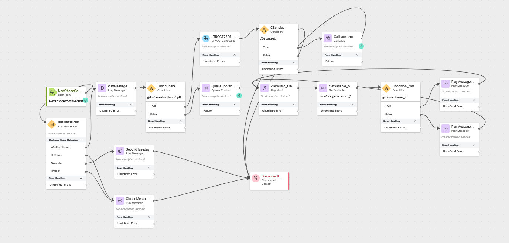

# Core Lab 5 - Business Hours Overrides

## Learning Objectives

In this section of the lab we will continue building and testing together.  We will create a new Business Hours Override which we will use to create a special treatment on the second Tuesday of every month of the summer.

## New Elements

## Create and Update Configuration Items

### Create a new Override for our Business Hours
> In Control Hub, navigate to Business Hours, click Overrides in the top ribbon, and click Create Overrides
>
> Name: <copy>CL<w class="POD"></w>_Overrides</copy>
>
> Description: <copy>CL<w class="POD"></w>__Overrides</copy>
>
> Timezone: <copy>America/Los_Angeles</copy>
>
> Click Add new override
>
>> Name: <copy>Second Tuesday June</copy>
>>
>> Start time: June, 10, 2025 03:00 PM (Time will be adjusted during the lab for testing)
>>
>> End time: June, 10, 2025 05:00 PM (Time will be adjusted during the lab for testing)
>>
>> Toggle Status On
>>
>> Click the check mark under Action
>
> Click Create
---

### Update your Business Hours to use the new Override
> Click the Overrides chevron in the ribbon section of the panel
>
> Click Working Hours in the top ribbon
>
> Open <copy>CL<w class="POD"></w>_Business Hours</copy>
>
> Scroll to the bottom of the page to additional settings
>
> Override: <copy>CL<w class="POD"></w>_Overrides</copy>
>
> Click Save
>
---

## Build

### Open flow <copy>CL<w class="POD"></w>_core</copy>
> Toggle the Edit switch on
>
---

### Add a Play Message node
> Activity Label: <copy>SecondTuesday</copy>
>
> Enable Text-To-Speech
>
> Select the Connector: Cisco Cloud Text-to-Speech
>
> Click the Add Text-to-Speech Message button
>
> Delete the Selection for Audio File
>
> Text-to-Speech Message: <copy>Happy second Tuesday of the month!  We are closing our office early every second Tuesday of the month over the summer so that our team can spend time with their families.  Please call back tomorrow. </copy>
>
> Delete the Override node edge connector between BusinessHours saf ClosedMessage
>
> Connect the Override node edge connector to this node
>
> Connect the outbound node edge from this node to the Disconnect Contact node
>
---

### 

Check your flow

---

### Publish your flow
> Turn on Validation at the bottom right corner of the flow builder
>
> If there are no Flow Errors, Click Publish
>
> Add a publish note
>
> Add Version Label(s): Live 
>
> Click Publish Flow

---

### Map your flow to your inbound channel
> Navigate to Control Hub > Contact Center > Channels
>
> Locate your Inbound Channel (you can use the search): <copy><w class="EP"></w></copy>
>
> Select the Routing Flow: <copy>CL<w class="POD"></w>_LARwCSAT</copy>
>
> Select the Version Label: Live
>
> Click Save in the lower right corner of the screen

---

## Testing
1. Launch the [Agent Desktop](https://desktop.wxcc-us1.cisco.com/) and log in using the Desktop option.
2. Using Webex, place a call to your Inbound Channel number <copy><w class="DN"></w></copy>
      1. What path did the call take in the flow?
3.  In Control Hub, navigate to Business Hours, click Overrides in the top ribbon, and click Create Overrides
        1.  Open <copy>CL<w class="POD"></w>_Overrides</copy>
        2.  Click the edit icon 
        3.  Toggle the status to off
        4.  Click the check mark under actions
        5.  Click Save
4. Using Webex, place a call to your Inbound Channel number <copy><w class="DN"></w></copy>
      1. What path did the call take in the flow?
5.  In Control Hub, navigate to Business Hours, click Overrides in the top ribbon, and click Create Overrides
        1.  Open <copy>CL<w class="POD"></w>_Overrides</copy>
        2.  Click the edit icon 
        3.  Toggle the status to on
        4.  Update the end time to be in the past
        5.  Click the check mark under actions
        6.  Click Save
4. Using Webex, place a call to your Inbound Channel number <copy><w class="DN"></w></copy>
      1. What path did the call take in the flow?

---

