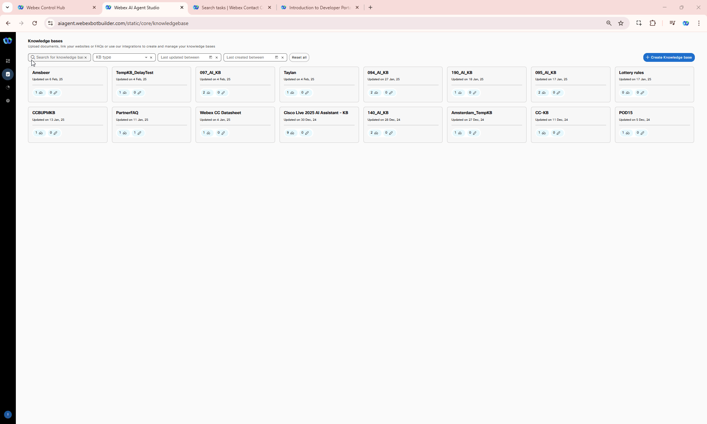

# Mission 7: AI Autonomous Agent in Action (BONUS)
 

## **Disclaimer**

Please note that the AI Agent is scheduled for General Availability (GA) in Q1 of the 2025 calendar year (CY25). This exercise is designed to provide you with an early glimpse and understanding of the feature's capabilities. We appreciate your participation and value your feedback as we refine this offering ahead of its official release.

**

Good to Know [Optional]
**

### AI Autonomous Agent Overview

The Autonomous AI Agent for performing actions can handle various tasks, including:

  - Natural Language Processing (NLP)—Understand and respond to human language in a natural and conversational manner.
  - Decision making—Make informed choices based on available information and predefined rules.
  - Automation—Automate repetitive or time-consuming tasks.

## Story

As a visitor to Amsterdam, you want to quickly find restaurants offering various international cuisines in the city and easily figure out how to get to them from your current location at the RAI.

### Call Flow Overview

1. A new call enters the flow.  
2. The caller asks about restaurants in Amsterdam. 
3. The AI agent responds with information generated from the knowledge base configuration. 

## Mission overview
Your mission is to:

1. Create a knowledge base (KB) and AI agent to provide answers about Amsterdam, including places to visit, restaurants, nightclubs, and directions from the current RAI Amsterdam Convention Center. 
2. Configure the AI agent with handoff functionality to transfer the conversation to a live agent when necessary. 

---

## Build

### Creating a Knowldge Base

1. [IMPORTANT] [Download](https://drive.google.com/drive/folders/1b8x_om4rQonuJ52wRYif1LPP5qEX4RDI?usp=sharing){:target="_blank"} source file from shared folder.
    
    > 
    > **Amsterdam_Tourist_Guide.txt** - file contains information for tourists like places to visit, restaurants, pubs etc. and how to reach those places from RAI Amsterdam Convention Center
    >

2. Login into [Webex Control Hub](https://admin.webex.com){:target="_blank"} by using your Admin profile **wxcclabs+admin_IDYour_Attendee_ID@gmail.com**. You will see another login screen with OKTA on it where you may need to enter the email address again and the password provided to you.

3. Go to Contact Center from the left side navigation panel, and under Quick Links, click on **Webex AI Agent**

      

4. In AI Agent Builder navigate to **Knowledge** from left hand side menu panel. 

5. Click **Create Knowledge Base**, provide Knowledge base name as **Your_Attendee_ID_AI_KB**, then click **Create**.

    

6. Click **Add File** or drag and drop file **Amsterdam_Tourist_Guide.txt** you downloaded from external drive on **Step 1**. Then click **Process Files**.

    

7. Navigate to **Dashboard** from the right-hand side menu panel and click **Create Agent**
8. Select **Start from Scratch** and click **Next**
9. On **Create an AI agent** page select the following select the type of agent: **Autonomous**

10. New section **Add the essential details** will appear. Provide the following information, then click **Create**:

    > Agent Name: **Your_Attendee_ID_AutoAI_Lab**
    >
    > System ID is created automatically
    >
    > AI engine: **Nova**
    >
    > Knowledge base: **Your_Attendee_ID_AI_KB**
    > 
    > Agent's goal: ***You are a helpful, polite agent who will help the user with their Amsterdam related queries such as restaurant, pubs, places to visit and what transport can be used to get there.***

    

11. Switch to **Actions** tab ans make sure **Agent handover** togle is turned on. This will allow you to handoff calls to human agent on request while talking to your Virtual Agent.

12. Switch to **Knowledge** tab and from **Knowledge base** drop-down list select **Your_Attendee_ID_AI_KB**

13. Click **Save Changes**, then click **Publish**. Provide any version name in popped up window (ex. "1.0").

    

14. Click on **Preview** to test your AI Agent and ask the following: **"I'm looking for an Italian restaurant close to RAI."**

---

## Integrating the Bot with Flow for Voice Calls

1. In Control Hub navigate to **Flows**, click on **Manage Flows** dropdown list and select **Create Flows**

2. Select Start Fresh and name the new flow **AutonomousAI_Flow_Your_Attendee_ID**

      

3. Make sure the **Edit** mode at the top is set to **ON**. Then, drag and drop the **Virtual Agent V2** and **DisconnectContact** activities from the left panel onto the canvas.

    !!! Note
        Please make sure to use **VirtualAgentV2** activity and **NOT** **VirtualAgent** also present on the Activity Library for Backward Compatability.

    > Connect the **New Phone Contact** output node edge to this **VirtualAgentV2** node
    >
    > Connect the Handled outputs to **DisconnectContact** 
    >
    > Connect the Errored outputs to **DisconnectContact** 
    >
    > Set **Static Contact Center AI Config**
    >
    > Contact Center AI Config: **Webex AI Agent (Autonomous)**
    >
    > Virtual Agent: **Your_Attendee_ID_AutoAI_Lab**

      

4. Drag and drop following nodes:

    - **Queue Contact** activity onto the Flow from the left side panel

      >
      > Connect the **Escalated** path from the **Virtual Agent V2** activity to the **Queue Contact** activity.
      >
      > Connect the **Queue Contact** activity to the **Play Music** activity
      >
      > Connect the **Failure** path from the **Queue Contact** activity to the **Disconnect Contact** activity.
      > 
      > Select **Static Queue**
      > 
      > Queue name: **Your_Attendee_ID_Queue**
      > 

    - **Play Music**

      >
      > Create a loop by connecting the Play Music activity back to itself - to create a music loop, following the diagram provided.
      >
      > Connect the **Failure** path from the **Play Music** activity to the **Disconnect Contact** activity.
      > 
      > Music File: **defaultmusic_on_hold.wav**
      >
  
5. **Validate** and **Publish** Flow. In popped up window click on dropdown menu to select **Latest** label, then click **Publish**  

      

6. Assign the Flow to your **Channel (Entry Point)** - Do this by first going to **Channel** > Search for your channel **Your_Attendee_ID_Channel**.
7. Click on **Your_Attendee_ID_Channel**
8. In **Entry Point** Settings section change the following:

    > Routing Flow: **AutonomousAI_Flow_Your_Attendee_ID**

    > Version Label: **Latest**

      

9. Dial Support Number assigned to your **Your_Attendee_ID_Channel** to test the Autonomous Virtual Agent over a voice call.

## Testing

1. Your Agent desktop session should be still active but if not, use Webex CC Desktop application   and login with agent credentials you have been provided **wxcclabs+agent_IDYour_Attendee_ID@gmail.com**. You will see another login screen with OKTA on it where you may need to enter the email address again and the password provided to you. 
2. Select Team **Your_Attendee_ID_Team**. Click **Submit**. Allow browser to access Microphone by clicking **Allow** on every visit.
3. Make your agent ***Available*** and you're ready to make a call.

    

4. Dial the support number assigned to your **Your_Attendee_ID_Channel** channel, and during the conversation with the virtual agent, ask about restaurants in Amsterdam or places to visit to explore historical sites.

5. Any time during conversation request to connect you with a live agent. The call will be transferred to your agent.

<strong>Congratulations, you have officially completed the Autonomous Virtual Agent mission! 🎉🎉 </strong>

