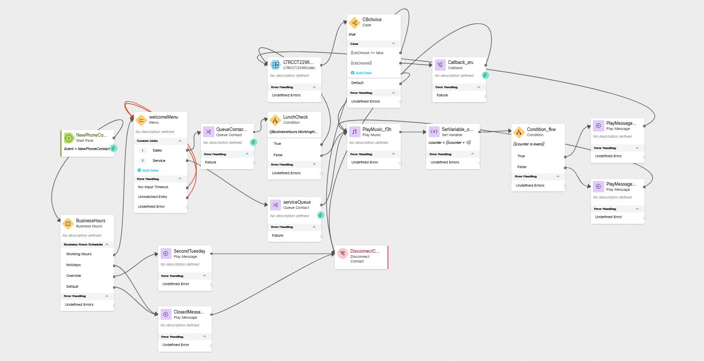

# Multiple Lines of Business Using the Same Flow

## Story
> You do not always need to create a new flow for each line of business in the contact center, instead you can often reuse your flow logic and account for the differences including different queues and wait treatments.  In this lab you will be adding a new line of business to the CL<w class="POD"></w>_core</copy> flow.

### High Level Explanation
1. This section is optional but can explain the order of operations
2. 

## Preconfigured elements
1. If you are using a prebuilt subflow or function 
2. You should call attention to a shared configuration item which is important to the success of the flow, like a connector  

## Build
### Open flow <copy>CL<w class="POD"></w>_core</copy>
> Toggle the Edit switch on
>
---
### Replace the welcome Play Message node with a Menu node
> Click on the welcome Play Message and delete it.
>
> Add a new Menu node
> >
> > Activity Label: welcomeMenu
> >
> > Enable Text-To-Speech
> 
> > Select the Connector: Cisco Cloud Text-to-Speech
>
> > Click the Add Text-to-Speech Message button
>
> > Delete the Selection for Audio File
>
> > Text-to-Speech Message: <copy>Thank you for calling Acme Corp. where we have been helping coyotes reach space since 1949.</copy>
> 
> > Click the Add Text-to-Speech Message button
>
> > Text-to-Speech Message: <copy>For Sales, press 1.  For Service, press 2.</copy>
>
> > Select Make Prompt Interruptible
>
> > Digit Number: 1 Link Description: Sales
>
> > Digit Number: 2 Link Description: Service
>
> > Connect the No-Input Timeout node edge to the input node edge of this node
>
> > Connect the Unmatched Entry node edge to the input node edge of this node
>
> > Connect the Sales node edge to the Queue Contact node
> 
---

### Move the LunchCheck node after the Queue Contact node
> Delete the connection between the Queue Contact node and the Play Music node
>
> Delete the connection between the LunchCheck False node edge and the Queue Contact node
> 
> Connect the Queue Contact output node edge to the LunchCheck input node edge (you may want to move the nodes around to make things cleaner)
>
> Connect the LunchCheck False node edge to the Play Music node

---

### Add a Queue Contact node
> Activity Label: <copy>serviceQueue</copy>
> 
> Select Static Queue
>
> Queue: <copy><w class="Queue2">yourQueueID</w></copy>
>
> Connect the Service node edge from WelcomeMenu to the input node edge of this node
>
> Connect the output node edge of this node to the play music node
---

### Add a variable mapping to the Subflow Node
> Scroll down to the Subflow Input Variables
>
> Click Add New
>
> Current Flow Variable: <copy>welcomeMenu.OptionEntered</copy>
>
> Subflow Input Variable: <copy>LOB</copy>
>
---

???+ Note "If you have already completed Offering a Callback option to calls actively waiting in the queue"
    ### Edit the first case in the CBchoice node
    > Open the CBchoice node
    >
    > Change the text in the first Link Description from {{cbChoice == false and BusinessHours.WorkingHoursShift_Name == "Lunch"}} to <copy>{{cbChoice == false and BusinessHours.WorkingHoursShift_Name == "Lunch" and welcomeMenu.OptionEntered == "1"}}</copy>

---

### when you are adding something to the canvas 
> list the fields and values
>
> list instructions like node connections
>
---

### 

Check your flow

---

### 

### Publish your flow
> Turn on Validation at the bottom right corner of the flow builder
>
> If there are no Flow Errors, Click Publish
>
> Add a publish note
>
> Add Version Label(s): Live 
>
> Click Publish Flow

---

### Map your flow to your inbound channel
> Navigate to Control Hub > Contact Center > Channels
>
> Locate your Inbound Channel (you can use the search): <copy><w class="EP"></w></copy>
>
> Select the Routing Flow: <copy>CL<w class="POD"></w>_LARwCSAT</copy>
>
> Select the Version Label: Live
>
> Click Save in the lower right corner of the screen

---

## Testing
1. Launch the [Agent Desktop](https://desktop.wxcc-us1.cisco.com/) and log in using the Desktop option.
2. list the streps
      1. double indent sub steps or sections
3. 

---

# Once you have completed the testing, go pick another adventure from the [Adventure Section](adventureList.md)