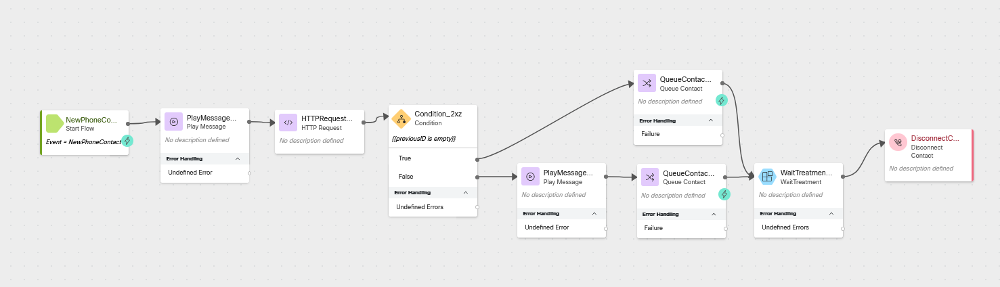

# Lab 1 - Routing Returning Callers

## Story
> When a customer calls back into the contact center within ten minutes of their last call ending, we can assume there was a dropped call, missed callback, or they need additional assistance from their last interaction.  We are going to prioritize their call in the queue so that they can finish their business.

### High Level Explanation
1. New call comes into the flow
2. Call the Search API to check if the ANI (caller's number) had a call which ended in the last 10 minutes
3. If the caller had a connected call which ended within the last 10 minutes, we will play a message and will queue the call with a higher priority so they will get assigned to the next available agent.
4. If the caller did not end a call with the contact center in the previous 10 minutes, we will queue the call normally

---

## Preconfigured Elements

1. Wait treatment Subflow which will provide Music in Queue and Queue Messages. 
2. Connector for calling Webex Contact Center APIs

---

## Build

### Create an new flow

> Create a flow named <copy>CL<w class ="POD">yourLabID</w>_ReturningCaller</copy>

---

### Create this flow variable

> Name: <copy>previousID</copy>
>
> Type: String
>
> Default Value: empty

---


### Add a Play Message node for our welcome message

> Connect the New Phone Contact output node edge to this Play Message node
>
> Enable Text-To-Speech
>
> Select the Connector: Cisco Cloud Text-to-Speech
>
> Click the Add Text-to-Speech Message button
>
> Delete the Selection for Audio File
>
> Text-to-Speech Message: <copy>Welcome to the routing returning callers lab.</copy>
>
---

### Add an HTTP Request node for our query

> Connect the output node edge from the play message node to this node
> 
> Select Use Authenticated Endpoint
>
> Connector: WxCC_API
> 
> Path: /search
> 
> Method: POST
> 
> Content Type: GraphQL
>
> Copy this GraphQL query section:
>
```GraphQL
query lastTen(
  $from: Long!
  $to: Long!
  $timeComparator: QueryTimeType
  $filter: TaskFilters
) {
  task(from: $from, to: $to, timeComparator: $timeComparator, filter: $filter) {
    tasks {
      id
      status
      channelType
      createdTime
      endedTime
      origin
      destination
      direction
      terminationType
      isActive
      isCallback
      lastWrapupCodeName
    }
  }
}
```
> Copy this into the Variables section:
``` JSON
{
  "from": "{{now() | epoch(inMillis=true) - 600000}}", # time now - 10 minutes represented in EPOCH time(ms)
  "to": "{{now() | epoch(inMillis=true)}}", # time now represented in EPOCH time(ms)
  "timeComparator": "endedTime",
  "filter": {
    "and": [
      {
        "status": {
          "equals": "ended"
        }
      },
      {
        "origin": {
          "equals": "{{NewPhoneContact.ANI}}" # ANI or caller phone number
        }
      },
      {
        "connectedCount": {
          "gte": 1
        }
      }
    ]
  }
}
```

> Parse Settings:
>
> Content Type: JSON
>
> - Output Variable: `previousID`
> - Path Expression: <copy>`$.data.task.tasks[0].id`</copy>
>
> ---

### Add a Condition node
> Connect the output from the HTTP Request node to this node
>
> Expression: <copy>`{{previousID is empty}}`</copy>
>
> We will connect the True node in a future step.
>
> Connect the False node edge to the Play Message node created in the next step.
>
---

### Add a Play Message node
> Connect the False node edge from the previous step to this node
>
> Enable Text-To-Speech
>
> Select the Connector: Cisco Cloud Text-to-Speech
>
> Click the Add Text-to-Speech Message button
>
> Delete the Selection for Audio File
>
> Text-to-Speech Message: <copy>It looks like you were just working with an agent and had to call back in.  We are prioritizing this call for the next available agent.</copy>
>
---

### Add a Queue Contact node
>  Connect the output node edge from the Play Message node added in the last step to this node
> 
> Select Static Queue
>
> Queue: <w class="Queue">yourQueueID</w>
>
> Select Static Priority
>
> Static Priority Value: P1
>
---

### Add a Subflow node
> In the Activity Library pane on the left side of the screen, click Subflows
>
> Find the Subflow names WaitTreatment and drag it onto the flow canvas like you would any other node.
>
> Connect the output node edge from the Queue Contact node added in the previous step to this node.
>
> Subflow Label: Latest
>
> Enable automatic updates: True
>
> Subflow Input Variables: None
>
> Subflow Output Variables: None
>
> Connect the output node edge from this node to the Disconnect Contact node added in the next step.


---

### Add a Disconnect Contact node

---

### Add a Queue Contact node
> Connect the True node edge from the Condition node to this node
> 
> Select Static Queue
>
> Queue: <w class="Queue">yourQueueID</w>
>
> Connect the Output node edge from this node to the Subflow node
---

### <details><summary>Check your flow</summary></details>

---

### Publish your flow
> Turn on Validation at the bottom right corner of the flow builder
>
> If there are no Flow Errors, Click Publish
>
> Add a publish note
>
> Add Version Label(s): Live 
>
> Click Publish Flow

---

### Map your flow to your inbound channel
> Navigate to Control Hub > Contact Center > Channels
>
> Locate your Inbound Channel (you can use the search): <copy><w class="EP"></w></copy>
>
> Select the Routing Flow: <copy>CL<w class="POD"></w>_ReturningCaller</copy>
>
> Select the Version Label: Live
>
> Click Save in the lower right corner of the screen

---

## Testing

1. Launch the [Agent Desktop](https://desktop.wxcc-us1.cisco.com/){:target="_blank"} and log in selecting the Desktop option for your Voice connection.
2. On your Agent Desktop, make sure your status is not set to available
      1. Using Webex, place a call to your Inbound Channel number <copy><w class="DN"></w></copy>
      2. After you hear the queue treatment start, you can abandon the call 
3. Using Webex, place another call to your Inbound Channel number <copy><w class="DN"></w></copy>
4. On your Agent Desktop, set your status to available
      1. You should be offered a call, click on the accept button. (You may want to mute the mic on both Webex and the Agent Desktop)
      2. After a few moments end the call and select a wrapup code.
5. In your Flow:
      1. Open the Debugger
      2. Select the last interaction (at the top of the list)
      3. Trace the steps taken in the flow
6. Answer these questions:
      1. Was the call queued with priority?
         1. Why or why not?
7. Close the Debugger
8. Using Webex, place another call to your Inbound Channel number <copy><w class="DN"></w></copy>
9. On your Agent Desktop, set your status to available
      1. You should be offered a call, click on the accept button. (You may want to mute the mic on both Webex and the Agent Desktop)
      2. After a few moments end the call and select a wrapup code.
10. In your Flow:
      1. Open the debugger
      2. Select the last interaction (at the top of the list)
      3. Trace the steps taken in the flow
11. Answer these questions:
      1. Was the call queued with priority?
         1. Why or why not?
      2. If you called another Inbound Channel number with the same flow logic, would your call be prioritized?
         1. How could you change this behavior? 


# Once you have completed the testing, go pick another adventure from the [Adventure Section](adventureList.md)
---
